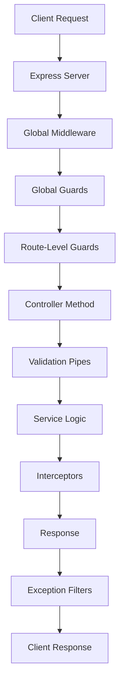
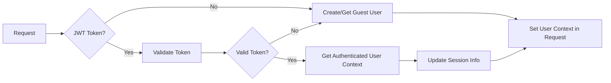
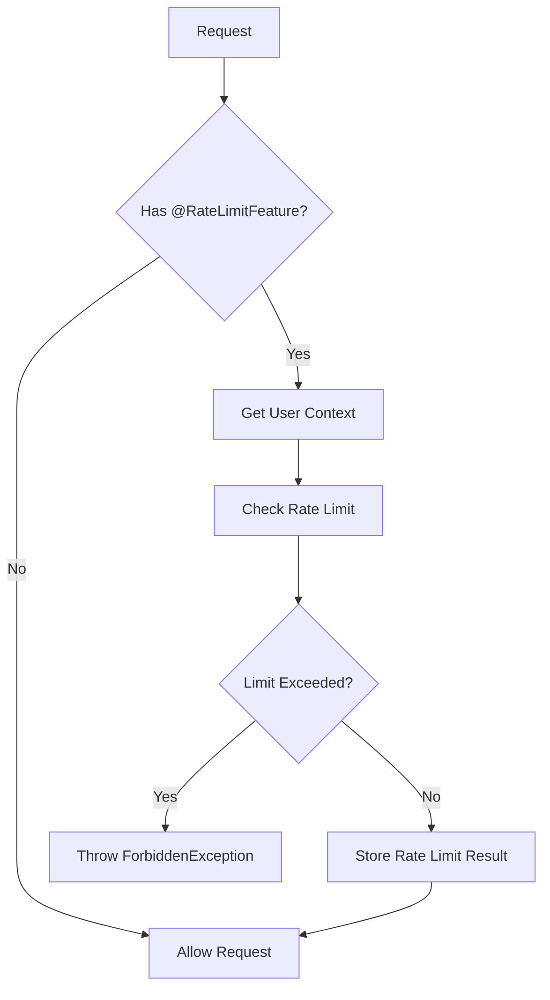
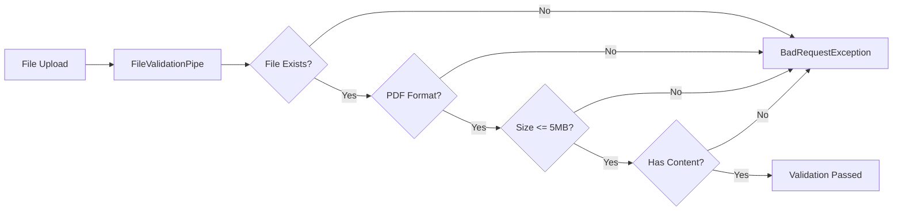
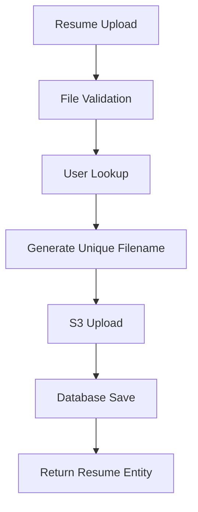
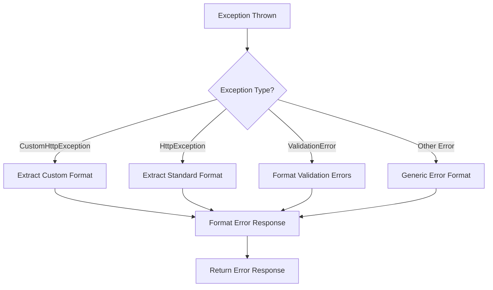
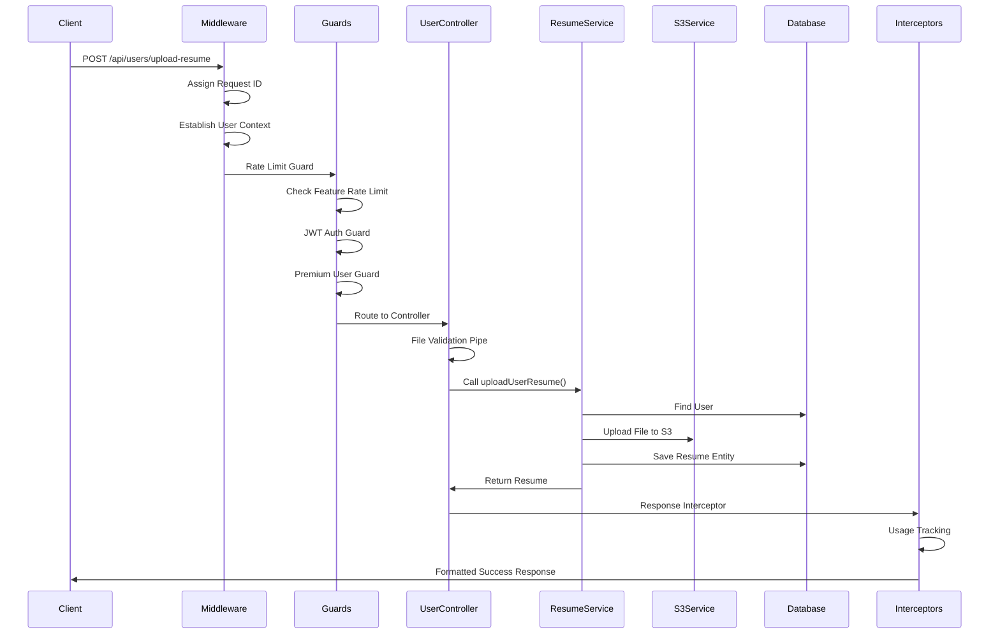
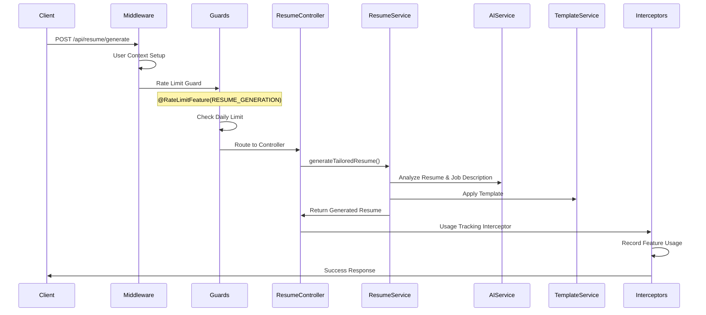
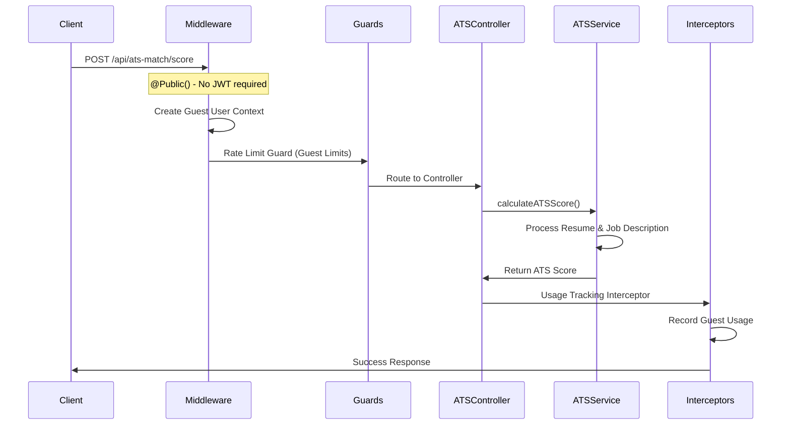

# ATS Fit Backend - API Execution Flow Documentation

## Overview

This document provides a comprehensive overview of the API execution flow in the ATS Fit Backend application, detailing all the components involved in processing requests from entry to response.

## How to View Diagrams

### Option 1: Mermaid-Compatible Viewers

To see the visual diagrams, use one of these options:

- **GitHub**: View this file directly on GitHub (supports Mermaid rendering)
- **VS Code**: Install the "Mermaid Preview" extension
- **Online**: Copy the Mermaid code to [mermaid.live](https://mermaid.live)
- **Markdown Viewers**: Use viewers that support Mermaid (like Typora, Mark Text)

### Option 2: Text-Based Diagrams

If you can't view Mermaid diagrams, this document includes text-based alternatives using ASCII art for all flow charts.

## Architecture Overview

### Visual Flow Diagram



## Request Processing Flow

### 1. Initial Request Processing

#### Request ID Assignment

- **Component**: `RequestIdMiddleware`
- **Location**: `src/shared/modules/response/request-id.middleware.ts`
- **Purpose**: Assigns a unique request ID to each incoming request for tracking and logging
- **Order**: First in the pipeline

```typescript
// Applied globally in main.ts
app.use((req: Request, res: Response, next: NextFunction) => {
  requestIdMiddleware.use(req, res, next);
});
```

#### User Context Middleware

- **Component**: `UserContextMiddleware`
- **Location**: `src/shared/middlewares/user-context.middleware.ts`
- **Purpose**: Establishes user context (authenticated/guest) for all requests
- **Features**:
  - JWT token validation
  - Guest user creation/retrieval
  - IP address and user agent tracking
  - User session info updates

```typescript
// Applied globally to all routes
consumer.apply(UserContextMiddleware).forRoutes('*');
```

**User Context Flow:**



### 2. Global Guards

#### Rate Limit Guard

- **Component**: `RateLimitGuard`
- **Location**: `src/modules/rate-limit/rate-limit.guard.ts`
- **Purpose**: Enforces rate limiting based on user type and feature usage
- **Applied**: Globally via `APP_GUARD`

**Rate Limiting Flow:**



#### JWT Authentication Guard

- **Component**: `JwtAuthGuard`
- **Location**: `src/modules/auth/jwt.guard.ts`
- **Purpose**: Validates JWT tokens and enforces authentication
- **Applied**: Globally via `APP_GUARD`
- **Features**:
  - Bypasses routes marked with `@Public()`
  - Uses Passport JWT strategy for token validation

### 3. Route-Level Guards

#### Premium User Guard

- **Component**: `PremiumUserGuard`
- **Location**: `src/modules/auth/guards/premium-user.guard.ts`
- **Purpose**: Ensures only premium users can access specific endpoints
- **Usage**: Applied to specific controller methods

```typescript
@Post('upload-resume')
@UseGuards(PremiumUserGuard)
async uploadResume() { ... }
```

### 4. Request Validation

#### Validation Pipes

- **Global Validation**: Applied globally in `main.ts`
- **File Validation**: `FileValidationPipe` for file uploads
- **DTO Validation**: Using `class-validator` decorators

```typescript
// Global validation pipe configuration
app.useGlobalPipes(
  new ValidationPipe({
    transform: true,
    whitelist: true,
    forbidNonWhitelisted: false,
    // ... other options
  }),
);
```

#### File Validation Pipeline



### 5. Controller Processing

#### Controller Structure

- **User Controller**: Handles user-related operations
- **Resume Controller**: Handles resume generation and templates
- **ATS Match Controller**: Handles ATS score calculations
- **Rate Limit Controller**: Provides rate limit statistics

#### Example: Resume Upload Flow

```typescript
@Post('upload-resume')
@UseGuards(PremiumUserGuard)
@UseInterceptors(FileInterceptor('resumeFile'))
async uploadResume(
  @UploadedFile(FileValidationPipe) resumeFile: Express.Multer.File,
  @Req() request: RequestWithUserContext,
): Promise<{ message: string; resumeId: string }>
```

### 6. Service Layer Processing

#### Service Components

- **ResumeService**: Core resume processing logic
- **AIService**: AI-powered resume analysis
- **S3Service**: File storage operations
- **UserService**: User management operations
- **RateLimitService**: Rate limiting logic

#### Resume Processing Pipeline



### 7. Interceptors

#### Response Interceptor

- **Component**: `ResponseInterceptor`
- **Location**: `src/shared/modules/response/response.interceptor.ts`
- **Purpose**: Wraps all successful responses in a standardized format
- **Applied**: Globally

```typescript
// Standard response format
{
  status: "success",
  message: "Operation completed successfully",
  code: "200",
  data: { ... },
  meta: {
    requestId: "uuid",
    timestamp: "ISO-8601",
    path: "/api/endpoint"
  }
}
```

#### Usage Tracking Interceptor

- **Component**: `UsageTrackingInterceptor`
- **Location**: `src/modules/rate-limit/usage-tracking.interceptor.ts`
- **Purpose**: Records feature usage after successful requests
- **Applied**: To specific endpoints with `@RateLimitFeature`

#### Validation Logging Interceptor

- **Component**: `ValidationLoggingInterceptor`
- **Location**: `src/modules/resume/interceptors/validation-logging.interceptor.ts`
- **Purpose**: Logs validation errors for debugging

### 8. Exception Handling

#### Global Exception Filter

- **Component**: `AllExceptionsFilter`
- **Location**: `src/shared/modules/response/exception.filter.ts`
- **Purpose**: Handles all exceptions and formats error responses
- **Applied**: Globally

**Exception Handling Flow:**



## API Endpoints Flow Examples

### 1. User Resume Upload



### 2. Resume Generation (with Rate Limiting)



### 3. ATS Score Calculation (Public Endpoint)



## Error Handling Examples

### 1. Rate Limit Exceeded

```json
{
  "status": "error",
  "message": "Rate limit exceeded for RESUME_GENERATION",
  "code": "ERR_RATE_LIMIT_EXCEEDED",
  "errors": null,
  "meta": {
    "requestId": "uuid",
    "timestamp": "2025-07-21T04:59:24.000Z",
    "path": "/api/resume/generate",
    "currentUsage": 5,
    "limit": 5,
    "remaining": 0,
    "resetDate": "2025-07-22T00:00:00.000Z",
    "feature": "RESUME_GENERATION",
    "userType": "REGISTERED",
    "plan": "freemium"
  }
}
```

### 2. Validation Error

```json
{
  "status": "error",
  "message": "Validation failed",
  "code": "400",
  "errors": [
    {
      "field": "jobDescription",
      "message": "Job description is required"
    },
    {
      "field": "companyName",
      "message": "Company name must be at least 2 characters long"
    }
  ],
  "meta": {
    "requestId": "uuid",
    "timestamp": "2025-07-21T04:59:24.000Z",
    "path": "/api/resume/generate"
  }
}
```

## Key Features

### 1. Rate Limiting System

- **Per-feature rate limiting**: Different limits for different operations
- **User type awareness**: Different limits for guest vs registered vs premium users
- **Automatic usage tracking**: Records successful feature usage
- **Configurable limits**: Database-driven rate limit configuration

### 2. Authentication & Authorization

- **JWT-based authentication**: Secure token-based auth
- **Public endpoints**: Some endpoints accessible without authentication
- **Premium user restrictions**: Certain features require premium subscription
- **Guest user support**: Automatic guest user creation for unauthenticated requests

### 3. Response Standardization

- **Consistent response format**: All responses follow the same structure
- **Request tracking**: Every request gets a unique ID
- **Error standardization**: All errors formatted consistently
- **Metadata inclusion**: Additional context in all responses

### 4. File Processing

- **Secure file upload**: File validation and S3 storage
- **Format validation**: Only PDF files allowed
- **Size restrictions**: Maximum file size enforcement
- **Unique naming**: Prevents file name conflicts

### 5. Logging & Monitoring

- **Comprehensive logging**: All major operations logged
- **Error tracking**: Detailed error information captured
- **Usage analytics**: Feature usage tracking for analytics
- **Performance monitoring**: Request timing and performance metrics

## Environment Dependencies

### Required Environment Variables

```bash
# Database
DATABASE_HOST=localhost
DATABASE_PORT=5432
DATABASE_USERNAME=postgres
DATABASE_PASSWORD=password
DATABASE_NAME=ats_fit

# JWT
JWT_SECRET=your-secret-key

# AWS S3
AWS_ACCESS_KEY_ID=your-access-key
AWS_SECRET_ACCESS_KEY=your-secret-key
AWS_BUCKET_REGION=us-east-1
AWS_S3_CANDIDATES_RESUMES_BUCKET=your-bucket-name

# API Keys
OPENAI_API_KEY=your-openai-key
CLAUDE_API_KEY=your-claude-key
```

## Performance Considerations

### 1. Caching

- **Template caching**: Resume templates cached in memory
- **Configurable TTL**: Cache timeout configurable via environment

### 2. Parallel Processing

- **Concurrent operations**: Template loading and text extraction run in parallel
- **Async operations**: All I/O operations are asynchronous

### 3. Database Optimization

- **Entity relationships**: Proper foreign key relationships
- **Indexes**: Strategic database indexing for performance
- **Connection pooling**: TypeORM connection pooling

## Security Features

### 1. Input Validation

- **DTO validation**: All input validated using class-validator
- **File validation**: Strict file type and size validation
- **SQL injection prevention**: TypeORM query builder prevents SQL injection

### 2. Rate Limiting

- **DDoS protection**: Rate limiting prevents abuse
- **Feature-specific limits**: Different limits for different operations
- **User-based tracking**: Limits tracked per user/IP

### 3. Authentication

- **JWT tokens**: Secure, stateless authentication
- **Token expiration**: Configurable token expiration
- **Bearer token format**: Standard Authorization header format

## Development Guidelines

### 1. Adding New Features

1. Create appropriate DTOs with validation
2. Add rate limiting if needed using `@RateLimitFeature`
3. Implement proper error handling
4. Add comprehensive logging
5. Write unit tests

### 2. Error Handling Best Practices

- Use custom exception classes
- Provide meaningful error codes
- Include relevant context in error responses
- Log errors appropriately

### 3. Testing Strategy

- Unit tests for services
- Integration tests for controllers
- E2E tests for complete flows
- Mock external dependencies

## Monitoring & Debugging

### 1. Request Tracing

- Each request has a unique ID
- Request/response logging
- Performance timing logs
- Error stack traces

### 2. Usage Analytics

- Feature usage tracking
- User behavior analytics
- Rate limit monitoring
- Performance metrics

### 3. Health Checks

- Database connectivity
- External service availability
- S3 bucket accessibility
- Application health endpoints

---

_This documentation is maintained alongside the codebase and should be updated when significant changes are made to the API flow or architecture._
